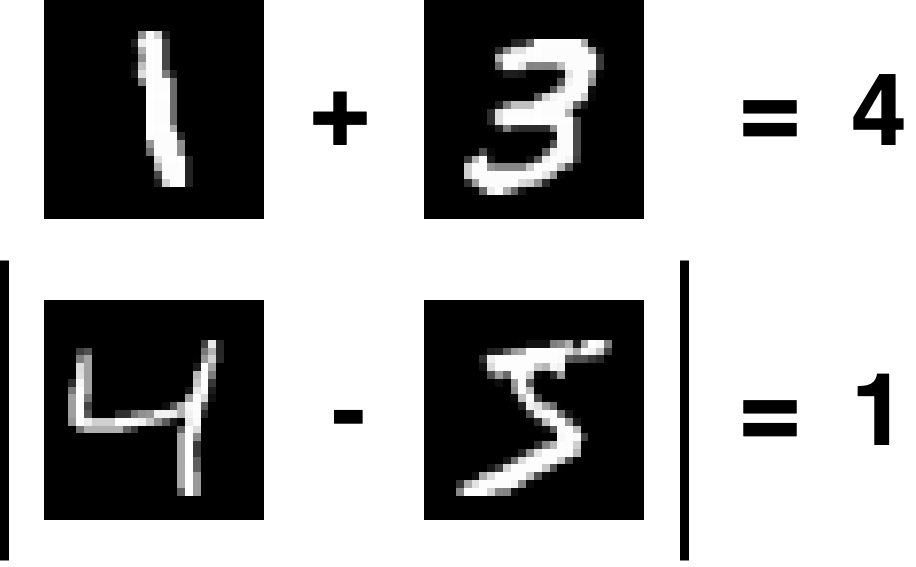

# MNIST_task
Learn a task like sum, abs_diff, eucl_dist with MNIST pairs.

The model is a siamese-like CNN implemented with Tensorflow/Keras.

## Task
The model learns to compute the following tasks:

## Requirements
| Software       | Version        | Required |
| -------------- |:--------------:| --------:|
| **Python**     |     >= 3.5     |    Yes   |
| **Numpy**      |Tested on v1.17 |    Yes   |
| **Tensorflow** |Tested on v2.0.0|    Yes   |
| **str2bool**   |     >= 1.0     |    Yes   |
